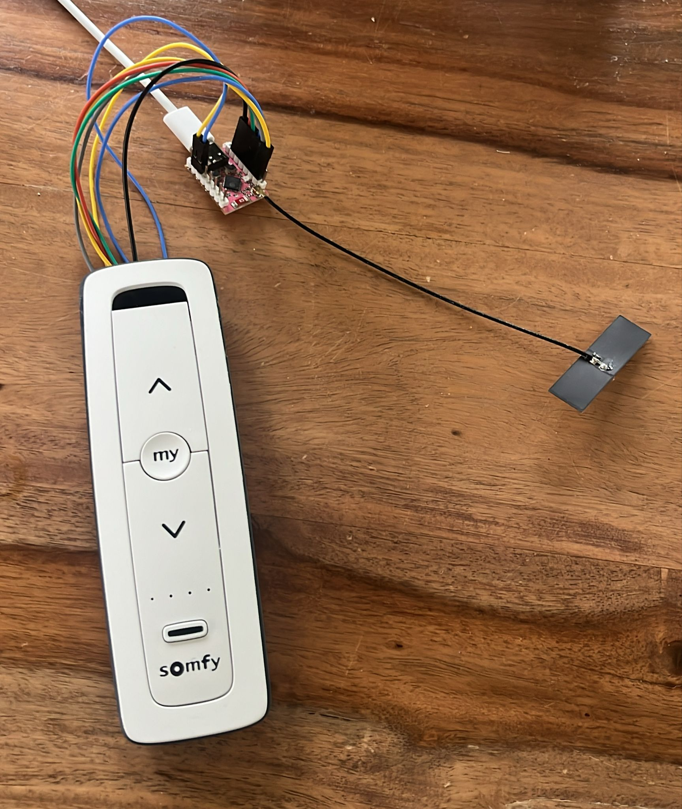

# 🎉🎉🎉 HAPPY BIRTHDAY PESHO!!! 🎉🎉🎉

What do you give a man who already has (almost) everything he wants? A way to control his sunscreens, of course!

We hope you will have fun with this home assistant-somfy remote control!

Thao, Petre, Teresa, Viktor, Lili, Rozemarijn and Tim



His home has sunscreens, but they use the horrible, propietary somfy system. After failing to 'hack' into the system with an SDR, the only option left is to hack into an existing remote.

Kudos to Andres Böhler, [who already proved the concept](https://www.aboehler.at/doku/doku.php/projects:somfy)

I've used cursor AI to help me develop the code. But I wouldn't call it vibe coding 😏

I created an ESPHome custom component that lets you control a physical Somfy remote by poking its GPIO pins. Basically, I'm making the ESP32 pretend to be your finger pressing buttons and reading the LEDs to figure out what's going on.

## What This Actually Does

Instead of manually pressing buttons on the remote, this component bridges the ESPHome/Home Assistant setup with the physical Somfy remote. It works by:

- Faking button presses on the remote control (the ESP32 presses buttons)
- Reading LED status to know which cover is selected
- Exposing everything as ESPHome entities so Home Assistant can control it

I broke LED1 and LED2 during development. So we're stuck working with LED3 and LED4. When cover 5 is selected, both LEDs light up and the readings get erratic, so we filter those out, in the ESPhome implementation. This information then gets used by the custom component.

### INSTALLATION

I've already compiled your wifi SSID and password, given to me by Marieke 🍋‍🟩. It should automatically connect.

Things you have to do:

- Install ESPhome integration
- Wait for the device to show up, and add to your config. Ask me for your API key....
- Add the cover templates to your configuration.yaml
- Create your own automations/scripts. Make sure you check the ready state, before writing a new command to the remote!


### Cover Control System

The component exposes buttons for each cover (Up, Down, Stop) that Home Assistant can use. Here's how it works:

1. **ESPHome exposes buttons**: For each cover (1-5), the component exposes three buttons:
   - `cover1up`, `cover1down`, `cover1stop` (and similarly for covers 2-5)
   - Each button automatically selects the correct cover first, then presses the appropriate command (UP/DOWN/MY)

2. **Home Assistant template covers**: The `template.yaml` file creates Home Assistant cover entities that use these buttons
   - When you open/close/stop a cover in Home Assistant, it presses the corresponding ESPHome button
   - The ESPHome component handles selecting the correct cover automatically
   - No need to manually select covers - it's all handled behind the scenes

This two-layer approach gives you clean cover entities in Home Assistant while keeping the complexity in the ESPHome component where it belongs.

## How It's Built

The component is split into three parts. The first two are compiled and uploaded to the ESP32. The 3rd one you control from home assistant:

1. **C++ Component** (`pesho_somfy.h` / `pesho_somfy.cpp`)
   - The brain that controls GPIO pins
   - Reads LED states
   - Manages the button pressing logic

2. **ESPHOME YAML Configuration** (`pesho_somfy.yaml`)
   - Where I've configure pins and entities
   - How it integrates with Home Assistant

3. **Home Assistant Template Configuration** (`template.yaml`)
   - Creates Home Assistant cover entities
   - Links ESPHome buttons to Home Assistant cover controls
   - Makes everything work seamlessly in your Home Assistant dashboard

### Home Assistant Integration

**Template Cover Configuration** (`template.yaml`):

The `template.yaml` file contains Home Assistant template cover configurations for all 5 covers. To use it:

1. Copy `template.yaml` to your Home Assistant configuration directory
2. Include it in your `configuration.yaml`:
   ```yaml
   template: !include template.yaml
   ```
   Or if you already have a `template:` section:
   ```yaml
   template:
     - !include template.yaml
   ```

3. Restart Home Assistant

This creates 5 cover entities in Home Assistant (Somfy Cover 1 through Somfy Cover 5) that automatically:
- Select the correct cover when you open/close/stop
- Press the UP button when opening
- Press the DOWN button when closing  
- Press the MY button when stopping

The ESPHome component handles all the cover selection logic, so you just interact with normal cover entities in Home Assistant.

**How Cover Control Works:**

When you press "Open" on "Somfy Cover 1" in Home Assistant:

1. Home Assistant calls the `open_cover` action from the template
2. Ready state -> FALSE
3. This presses the `button.peshosomfy_cover1up` ESPHome button
4. The ESPHome component receives the button press
5. `cover_open(0)` is called, which:
   - Checks if Cover 1 (index 0) is already selected
   - If not, selects Cover 1 first (using the simple select method)
   - Then presses the UP button
6. Your cover opens
7. Ready state -> TRUE

The same flow works for close and stop actions. All the complexity of cover selection is handled automatically by the component.

**However, when running these actions from an automation inside of home assistant, be sure to check whether the device is busy or not. Otherwise the button presses will be ignored!! There is no queue inside the component, so you have to take care of this inside your home assistant setup.**

## Component Lifecycle

1. **Setup Phase** (`setup()`):
   - Configures all button pins as INPUT (high impedance)
   - Configures LED pins as INPUT if configured
   - Initializes cover index to 3 (Remote Cover 4)
   - Publishes initial ready state to binary sensor if linked
   - Logs pin configuration and initial cover index

2. **Loop Phase** (`loop()`):
   - **Non-blocking button release**: Checks if button press duration has elapsed and releases button
   - **LED synchronization**: Syncs cover index from LED states every 2 seconds (when not busy and not immediately after select operation). This only works for LED3 & LED4
   - **Select cover state machine**: Handles automatic cover selection if active (includes reset phase if needed)
   - **Ready state tracking**: Monitors and publishes ready/busy state changes to Home Assistant
   - **Debug logging**: Logs active cover number every 5 seconds

3. **Button Press**:
   - Executed on-demand when methods are called
   - Uses non-blocking state machine (never blocks for more than 30ms)
   - Safe GPIO sequence prevents damage to remote control
   - For select_cover during selection phase: automatically increments cover index after each press

## Safety Features

- **High Impedance Default**: All pins default to INPUT mode (floating)
- **Safe Press Sequence**: LOW set before OUTPUT mode to prevent HIGH pulses
- **Null Checks**: All methods check for null pointers before accessing pins
- **Configurable Duration**: Button press duration is configurable to match remote requirements
- **Non-Blocking Operations**: All operations complete in <30ms per loop iteration, preventing ESPHome warnings
- **State Machine Protection**: Prevents multiple simultaneous button presses or operations
- **LED-Based Verification**: Automatic cover synchronization ensures accurate state tracking
- **Operation Conflict Prevention**: Ready/busy state management prevents conflicting operations
- **Simple Select Method**: Always starts from known position (Cover 3) for reliable cover selection

## License

This project is licensed under the MIT License - see the [LICENSE](LICENSE) file for details.

The MIT License allows you to:
- ✅ Use the code commercially
- ✅ Modify the code
- ✅ Distribute the code
- ✅ Sublicense the code
- ✅ Use privately

**Requirements:**
- Include the original copyright notice and license text
- State any significant changes made to the code

**No warranty or liability:** The software is provided "as is" without warranty of any kind.

## Credits

Created by Tim